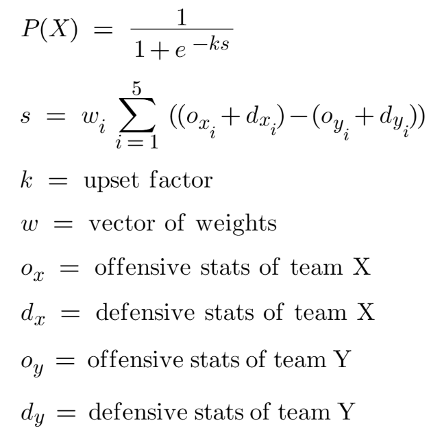

# March Madness 2026 Monte Carlo Simulation

#### This is the repository for an R script that obtains NCAA men's basketball team statistics and simulates a 64-team March Madness bracket. Progression is based on a probability formula dependent on match-specific differentials for seed and the "Four Factors".

Using the rvest library, team information (qualifying teams and their seeds) are scraped from the NCAA live bracket page, and statistics for each team (the Four Factors: eFG%, TO%, ORB%, FTR) are scraped from barttorvik.com. These statistics are used in a custom probability formula that determines the likelihood of team X winning in a match between team X and team Y.

The probability formula is as follows:

Here, the variables for the team statistics are vectors with the seed as the first entry (offensive only; 0 for defensive) followed by the Four Factors in the previously mentioned order.

Parameters k and w can be altered to one's liking; as I have it currently, k = 1 and w = (0.25, 0.3, 0.2, 0.15, 0.1).

This formula is run for each game of each round, with the winners and full bracket being stored. This process is then simulated 1000+ times, and aggregate probabilities of each team reaching each round are calculated and stored in a data frame as the final results.
